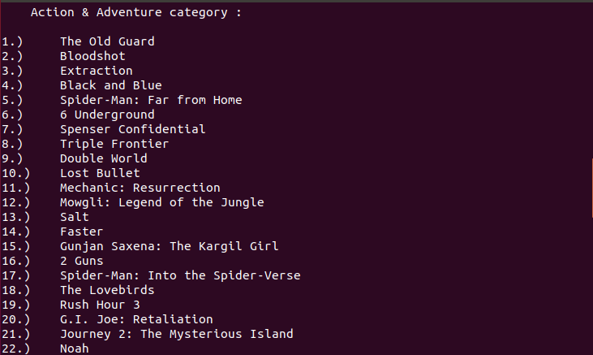

# Web_Scraper

> This project is a ruby capstone project from the [Microverse](https://www.microverse.org/) technical curriculum

## Contents
- [Description](#description)

- [Built With](#built-with)

- [How to deploy this scraper](#how-to-deploy-this-scraper)

- [How to use this Web scraper](#how-to-use-this-web-scraper)

- [Contributions](#contributions)

- [Authors](#authors)

## Description

**Web scraping**, also known as **web data extraction**, is the process of retrieving or “scraping” data from a website. Unlike the mundane, mind-numbing process of manually extracting data, web scraping uses intelligent automation to retrieve hundreds, millions, or even billions of data points from the internet’s seemingly endless frontier. [Read more at scrapinghub...](https://www.scrapinghub.com/what-is-web-scraping/)

**This project demonstrates an example of Web scraping by retrieving data from the [Movies | NETFLIX](https://www.netflix.com/ug/browse/genre/34399) webpage and presenting it to the user.**


The Scraper presents retrieved data to the user in 3 phases all of which depend on their selection or response :

- **Phase 1** : A list of movie categories
- **Phase 2** : A list of movies from a particular category
- **Phase 3** : Information about **A MOVIE** from the list of movies in **Phase 2**


  CATEGORIES |
  -----------|
   |
  
  MOVIE LIST |
  -----------|
   |
  
  MOVIE INFORMATION |
  ------------------|
   |


  ## Built With

  - Ruby
  - Nokogiri Gem

  ## Tested With

  - Rspec 3.9

  ## How to Deploy this Scraper
  > This scraper can be deployed on the following platforms.

  > A. [Your Computer](#a-on-your-computer)

  > B. [Online](#b-online)


### A. On your computer

#### Pre-requisites
1. You should have [Ruby](https://www.ruby-lang.org/en/) installed on your computer.
1. Your computer should be able to run `terminal` or `command prompt` or `bash` or `Powershell` commands.

#### Using a Repository
1. Run this command `git clone https://github.com/RNtaate/Web_Scraper.git` to clone the repository on to your local machine.
1. Run `cd Web_Scraper` to enter into the scraper folder
1. Run the following command to deploy the scraper

```bash
    bin/main.rb
```
4. At this point, you should see a welcome message indicating the scraper has opened.

### B. Online

1. click the following link  [Scraper's link](https://repl.it/@RNtaate/WebScraper#bin/main.rb)
1. When the link has been opened, click the `green run button` you will see at the top to run the Scraper.

## How to use this Web Scraper
1. When the scraper is opened, it displays a brief description of how to obtain information and then asks you to enter 'y' or 'yes' if you wish to continue or enter any other key to abort.

1. When you choose to continue, the Scraper will take a couple of seconds to fetch the required information.
1. When it is done retrieving data, it will display a list of movie categories as seen in the **CATEGORIES** image above.
1. At this point, below the list, the Scraper will ask you to enter a category selection by typing the number appearing before your choice of category.
1. When you enter a valid number, the scraper will display a list of movies contained with in your category of choice as seen in the **MOVIE LIST** image above
1. Again, at this point, below the movies list, the Scraper will ask you to enter a movie selection by typing the number appearing before your choice of movie.
1. When you make a valid selection, the Scraper will take a couple of seconds to fetch the information about your choice of movie.
1. When it is done retrieving data, it will display the information about the movie you selected in step **6** as seen in the **MOVIE INFORMATION** image above.
1. After successfully displaying this information, the Scraper will further request you to enter 'y' or 'yes' if you wish to continue or any other key to abort.
1. When you choose to continue, the Scraper will go back to step **3** of this process.

## Contributions

There are two ways of contributing to this project:

1.  If you see something wrong or not working, please check [the issue tracker section](https://github.com/RNtaate/Web_Scraper/issues), if that problem you met is not in already opened issues then open the issue by clicking on `new issue` button.

2.  If you have a solution to that, and you are willing to work on it, follow the below steps to contribute:
    1.  Fork this repository
    1.  Clone it on your local computer by running `git clone https://github.com/RNtaate/Web_Scraper.git` __Replace *RNtaate* with the username you use on github__
    1.  Open the cloned repository which appears as a folder on your local computer with your favorite code editor
    1.  Create a separate branch off the *master branch*,
    1.  Write your codes which fix the issue you found
    1.  Commit and push the branch you created
    1.  Raise a pull request, comparing your new created branch with our original master branch [here](https://github.com/RNtaate/Web_Scraper)

  ## Authors

  👤 **Roy Ntaate**

- Github: [@RNtaate](https://github.com/RNtaate)
- Twitter: [@RNtaate](https://twitter.com/RNtaate)
- Linkedin: [roy-ntaate](https://linkedin.com/in/roy-ntaate)


## Show your support

Give a ⭐️ if you like this project!

## Acknowledgments

- This project was inspired by the [Microverse](https:www.microverse.org) program

## 📝 License

This project is [MIT](lic.url) licensed.
